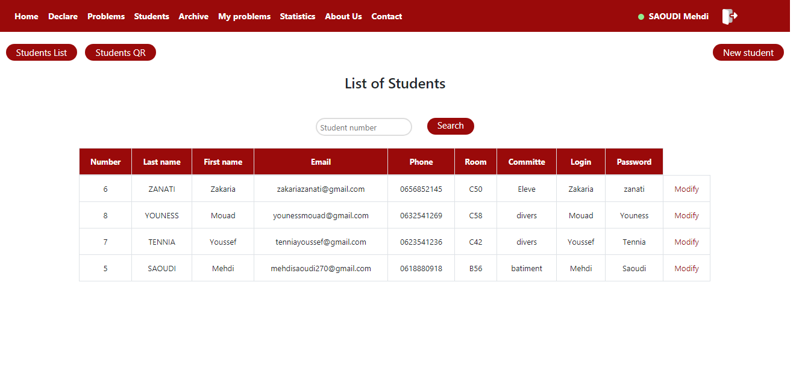

# 2019_DW_Pr14

<h1>Ensias Solvely (Projet Entr'aide)</h1>
<h2>Ensias Solvely </h2> est un moyen efficace, a toute épreuve afin de répondre aux besoins des différents étudiants qui ont plusieurs problèmes lors de leurs années d'études a l'ENSIAS

<h2>Contributeurs:</h2>

=> SAOUDI Mehdi

=> TENNIA Youssef

=> YOUNESS Mouad

=> ZANATI Zakaria

<h2>Supervisé par:</h2>

 PR. EL Hamlaoui Mahmoud

<h2>Captures :</h2>

<h3>Accueil</h3>

    

<h3>Login</h3>

 

<h3>HOME élève</h3>

 

<h3>HOME admin</h3>

 

<h3>Déclarer un problème</h3>

 

<h3>Problème élève</h3>

 

<h3>Problème admin</h3>

 

<h3>Trairement problèmes URGENCE<h3>

 

<h3>Problèmes personels</h3>

 

<h3>Reporting problèmes</h3>

 

<h3>Archivage</h3>

 

<h3>Ajouter un nouveau étudiant</h3>

 

<h3>Liste élève</h3>

 

<h3>Identification des étudiants a l'aide d'un code QR</h3>

 

<h3>Reporting Liste des étudiants</h3>

 

<h3>Gestion profil</h3>

 

<h1>Statistiques</h1>
<h3>Distribution selon comité batiment</h3>

 

<h3>Distribution selon comité divers</h3>

 

<h3>Distribution selon les comités</h3>

 

<h3>Distribution globale</h3>

 

<h3>About US</h3>

 

<h3>Contact US</h3>

 

